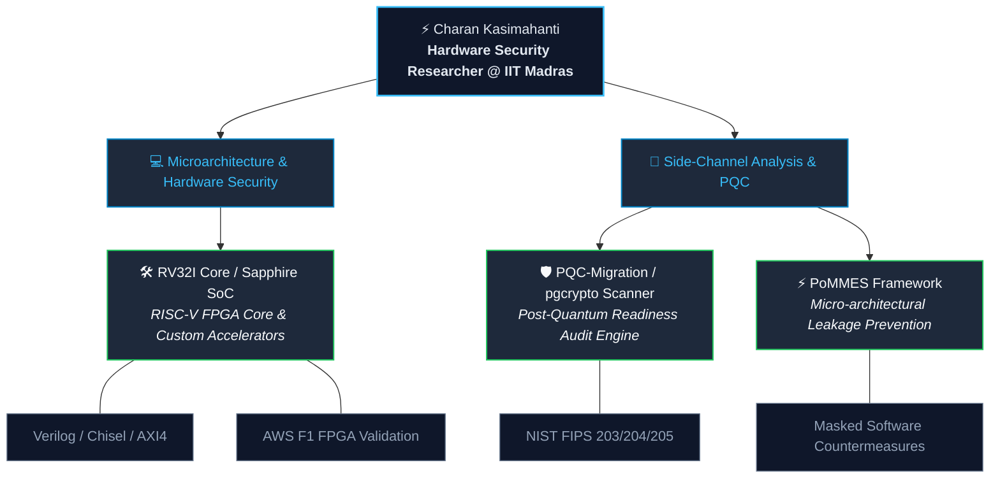

  <!-- Dynamic Typing Banner -->
  

  <h1>Hi, I'm Charan Kasimahanti 👋</h1>

  

    <b>Project Associate @ Cystar Lab, IIT Madras</b> 
    <i>Specializing in Hardware Security, Side-Channel Vulnerabilities, & Post-Quantum Cryptography</i>
  

  <!-- Contact Badges -->
  

    
    
  

 

---

## 🔬 Research Focus & Technical Domains

I specialize in securing hardware at the foundational level—preventing microarchitectural leakage and establishing post-quantum cryptographic resilience on custom processor architectures and database infrastructure.

<table>
  <tr>
    <td width="50%" valign="top">
      <h3>💻 Microarchitecture & Hardware Security</h3>
      <ul>
        <li><b>Micro-architectural Leakage Prevention:</b> Researching transient execution countermeasures and hardware security primitives.</li>
        <li><b>RISC-V Architectures & GPU Acceleration:</b> Designing custom Verilog/Chisel cores, pipeline optimization, and CPU-GPU co-design.</li>
        <li><b>FPGA Prototyping:</b> Synthesis, AXI4 bus integration, and validation on AWS F1 FPGAs.</li>
      </ul>
    </td>
    <td width="50%" valign="top">
      <h3>🔐 Side-Channel Analysis & PQC</h3>
      <ul>
        <li><b>Side-Channel & Fault Analysis:</b> Evaluating differential power analysis (DPA) and fault injection vulnerabilities.</li>
        <li><b>Post-Quantum Cryptography (PQC):</b> Auditing legacy database encryption & implementing NIST FIPS 203/204/205 PQC standards.</li>
        <li><b>RTL-to-GDSII Design Flow:</b> ASIC synthesis, static timing analysis (STA), and floorplanning.</li>
      </ul>
    </td>
  </tr>
</table>

 

## 🛠️ Core Technical Stack & Engineering Tools

  <!-- Skillicons -->
  

    

  <!-- Specialized Domain Badges -->
  
  
  
  
  

 

## 🧠 Research Architecture & Repository Ecosystem

 

## 📊 GitHub Performance & Analytics

  <table border="0">
    <tr>
      <td>
        
      </td>
      <td>
        
      </td>
    </tr>
  </table>

   

  

 

---

  <i>"Securing hardware at the silicon level against next-generation microarchitectural and quantum threats."</i>  
  <b>Cystar Lab, Department of Computer Science & Engineering, IIT Madras</b>

